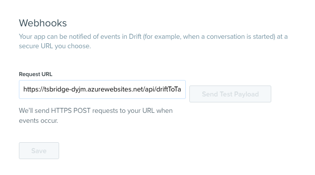
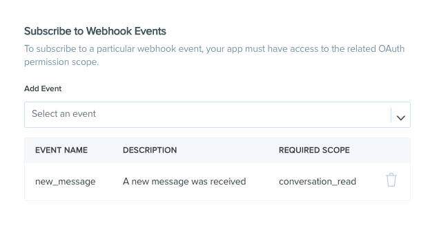
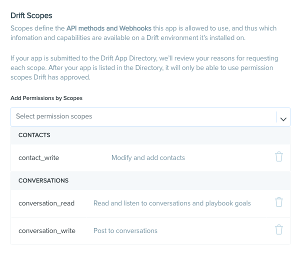
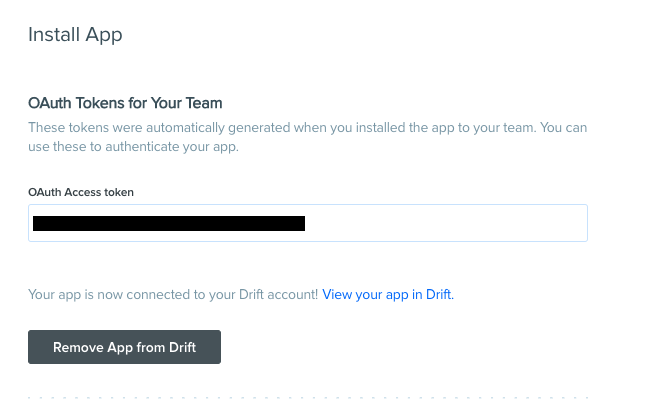

# Talksuite PoT
## Drift <-> Talksuite webhook bridge

This repo contains the code, template, dialogues and package to one click deploy a Drift to talksuite bridge. Drift is a chat marketing and customer support product & talksuite is a enterprise bot building platform.

The button below will open Azure and prompt you with the infomation required to deploy this brige.

In Drift, create a new app at [dev.drift.com](dev.drift.com) and configure the webhook request URL to `https://your-deployment.azurewebsites.net/api/driftToTalksuiteBridge`.

In addition, make sure that you configure your webhook to recieve the `new_message` event.

For talksuite to manage your drift conversation you need to configure the drift app to use `contact_write`, `conversation_read` and `conversation_write` scopes.

You will also need to deploy the appropriate dialogues to the talksuite organisation. To do so:
* Install the talksuite CLI by running `npm i @talksuite/talksuite-cli -g`.
* Log in to the CLI with your talksuite account by running `ts login`.
* Download or checkout this repo.
* Run the following command in the root folder `ts import-content ./dialogues/` and choose the organisation you want to use.

In talksuite your bot should be configured with:
* The webhook secret should be `talksuite<3drift`
* A constant called `driftToken` with your OAuth Access token which can be found in the Drift App config screen.
* The "Handoff" project

